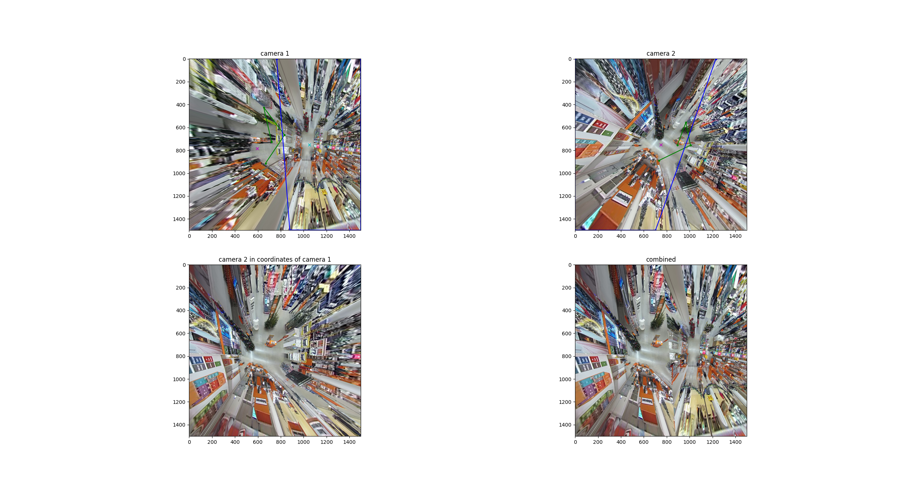

# fisheye stitching  
Here is a stiticing of two images into one in a "semi-automatic' way.     
The two images are fisheye camera images:  
[camera 1 image](./images/camera_1.jpg)  
[camera 2 image](./images/camera_2.jpg)  
It is a shop.  

The task is to stitch 2 frames of 2 cameras.  
The cameras looks down.  
The stiched image is projected onto the floor surface.
  
First camera was calibrated. Both cameras are same. Camera parameters found:
```text
DIM = (2560, 1920) # input video dimetions, (width, height)
K = np.array([[660.6883514485156, 0.0, 1294.1580197345322], [0.0, 661.8183036998079, 985.5144341662063], [0.0, 0.0, 1.0]]) # final camera marix constants (focus and shifts)
D = np.array([[-0.01393423897472937], [-0.009833220533829656], [0.006403434693351997], [-0.0018652582823445753]]) # camera distortion coefficients
```
Then 4 corisponded pairs for two images was labaled manually.  
Then a hamography was found.  
Then second image defisheye process was modified to have second image in coordinate system of the first defiesheyed image.  
Then both image were combined in to one with a mask.  
The mask edge is a line that goes between principal points of the cameras.  
Here is how it works:  
  
Here the green contour is the 4 points that used to reconstuct the hamography.  
Cyan cross is the princiapl point oft the first camera.     
Magenta cross is the princiapl point oft hte second camera.
In frits picture blue contour is the mask.  
Here is the combined image: [combined.png](./combined.png)


